### Topic : Database Transactions
----

In a Database Management System (DBMS), a transaction is a sequence of one or more SQL operations that are executed as a single unit of work. These operations can include reading, writing, updating, or deleting data. The primary goal of a transaction is to ensure data integrity and consistency, even in the presence of system failures, errors, or concurrent access by multiple users.

Transactions in DBMS are governed by four key properties, often referred to as ACID properties:

Atomicity: This ensures that all the operations within a transaction are completed successfully. If any operation fails, the entire transaction is rolled back, leaving the database in its previous state. This is often summarized by the phrase "all or nothing."

Consistency: This property ensures that a transaction brings the database from one valid state to another valid state, maintaining the integrity constraints. Before and after the transaction, the database must be in a consistent state.

Isolation: This property ensures that the operations of a transaction are isolated from other transactions. Concurrent transactions should not interfere with each other. The intermediate state of a transaction should not be visible to other transactions. This is often achieved through locking mechanisms.

Durability: Once a transaction has been committed, it remains committed even in the event of a system failure. The changes made by the transaction are permanent and stored in non-volatile memory.

Transaction Control Commands

BEGIN TRANSACTION: Marks the beginning of a transaction.

COMMIT: Saves all changes made during the transaction to the database.

ROLLBACK: Reverts all changes made during the transaction, restoring the database to its previous state.

Example;

created the database named test_transaction.

connected to the database.

created the table named accounts.

inserted the data to the accounts table.

retrieving all records from a table named accounts
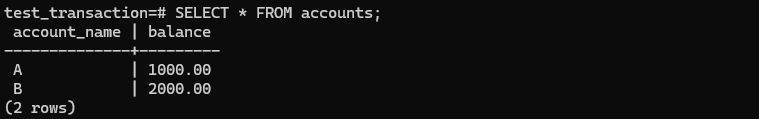

starting the transaction.
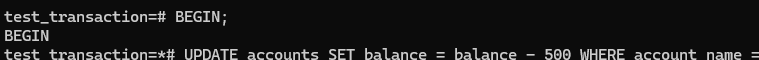

updating the data from the accounts table.
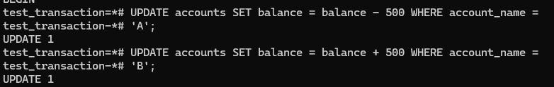
which this query decreases the balance of account 'A' by 500 units and  increases the balance of account 'B' by 500 units.

commiting the transaction.

This command saves the changes made by the previous UPDATE commands to the database. Once committed, these changes are permanent.

retrieves all records from the accounts table.
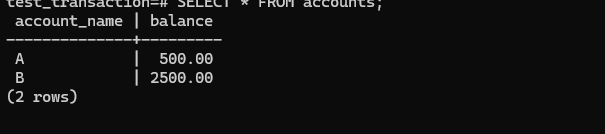
we can see that update has been performed successfully.

Transaction States

A transaction in DBMS typically goes through several states:

Active: The initial state when the transaction is being executed.

Partially Committed: After the final statement has been executed, but before the transaction has been fully committed.

Committed: When the transaction has been successfully completed and changes have been saved to the database.

Failed: If an error occurs during the transaction, it moves to the failed state.

Aborted: The transaction has been rolled back due to failure or user intervention, and the database is restored to its state before the transaction started.

Exapmle;

1.Active:

starting the transaction.
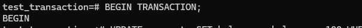

updating the database.

This command updates the accounts table by decreasing the balance of the account with the name 'A' by 100 units.

committing the transaction and retrieving the all data from the account table.
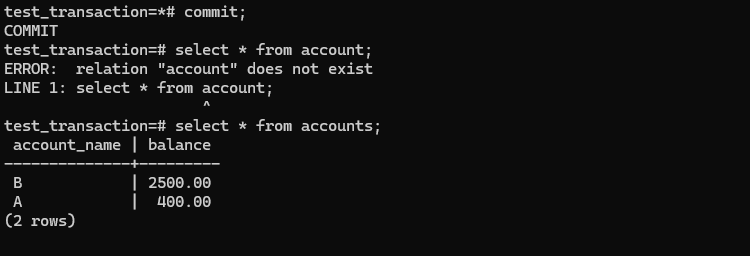
Here we can see that the update is done successfully.

2.Partially Committed:

starting the transaction.
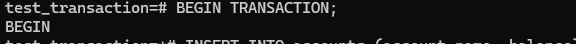

updating the data.

which is inserting the data into the account table with the account_name 'c' and balance 500.

commiting the updated and retreiving the data from the account table.
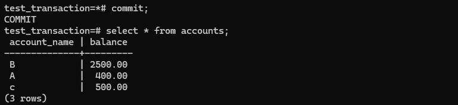
here we can see that insert has been done successfully.

3.Failed:

starting the transaction.

updating the data.

This command attempts to update the accounts table by decreasing the balance of the account with the name 'C' by 50 units.

Rolling back the transaction and also retreiving the data from the account table.
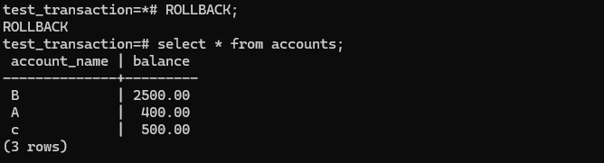
This command rolls back the current transaction, undoing any changes made within it. It ensures that the database is restored to its state before the transaction began.And also we can see that nothing changes has been done.

4.Aborted:

starting the transaction.

updating the data.

This query is trying to insert the data to the accounts table.

Rolling back the transaction.

retrieving the data.
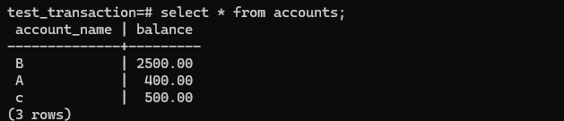
Since the transaction was rollback which means not made any changes in the table.

5.Committed

starting the transaction.

updating the data.

inserting the data into the accounts table.

committing the transaction and retrieving the data from the accounts table.
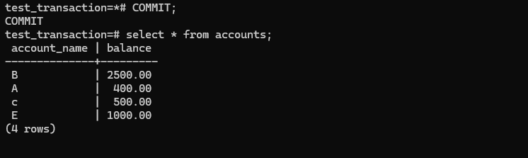
which means the transaction was updated successfully and saved.

Conclusion

Transactions are fundamental to the robustness and reliability of a DBMS, ensuring that data remains accurate and consistent despite errors, failures, or concurrent access. By adhering to the ACID properties, transactions provide a dependable way to manage database operations.

### Topic: Serializability
----

What is Serializability?

Serializability of schedules ensures that a non-serial schedule is equivalent to a serial schedule. It helps in maintaining the transactions to execute simultaneously without interleaving one another. In simple words, serializability is a way to check if the execution of two or more transactions are maintaining the database consistency or not.

Schedules and Serializable Schedules in DBMS
Schedules in DBMS are a series of operations performing one transaction to the other.

Type of Schedules.

1.Serial Schedules
A serial schedule is one in which transactions are executed sequentially, one after the other, without overlapping. This means no interleaving of operations from different transactions. Each transaction must be completed before the next one begins. Serial schedules are naturally conflict-free and always maintain the consistency of the database.

Example:

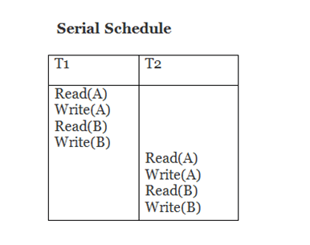

Transaction T1: Read A, Write A
Transaction T2: Read B, Write B
A serial schedule could be:

T1: Read A, Write A
T2: Read B, Write B

2.Non-Serial Schedules
Non-serial schedules allow the interleaving of operations from different transactions. These schedules are more common in practice as they can increase system throughput and resource utilization. However, not all non-serial schedules preserve consistency.

Example:

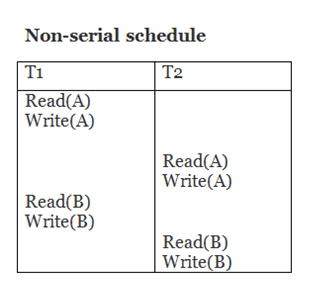

Transaction T1: Read A, Write A
Transaction T2: Read B, Write B
A non-serial schedule could be:

T1: Read A
T2: Read B
T1: Write A
T2: Write B

3.Conflict Serializability
A non-serial schedule is conflict-serializable if it can be transformed into a serial schedule by swapping non-conflicting operations. Two operations conflict if they:

Belong to different transactions,
Access the same data item, and
At least one of them is a write operation.
If a non-serial schedule can be rearranged through a series of swaps of non-conflicting operations to produce a serial schedule, it is conflict-serializable.

Example:

T1: Read A
T2: Read B
T1: Write A
T2: Write B
This can be transformed to a serial schedule:

T1: Read A, Write A
T2: Read B, Write B

4.View Serializability
A non-serial schedule is view-serializable if it is equivalent to a serial schedule in terms of the initial reads, the final writes, and the intermediate reads/writes of data items. View serializability is a broader concept than conflict serializability and includes all conflict-serializable schedules, as well as some additional schedules that conflict serializability does not include.

Example:

Transaction T1: Read A, Write A
Transaction T2: Read A, Write A
A non-serial schedule that is view-serializable might have:

T1: Read A
T2: Read A
T2: Write A
T1: Write A

conclusion

In conclusion, serializability ensures database consistency by verifying that non-serial schedules are equivalent to serial ones. Serial schedules execute transactions sequentially, preserving consistency naturally. Non-serial schedules, which interleave operations for efficiency, must be analyzed for conflict or view serializability. Conflict serializability checks if non-serial schedules can be rearranged into serial ones through swaps of non-conflicting operations, while view serializability ensures equivalence in data operations' visibility. These concepts are essential for maintaining database integrity during concurrent transactions.

