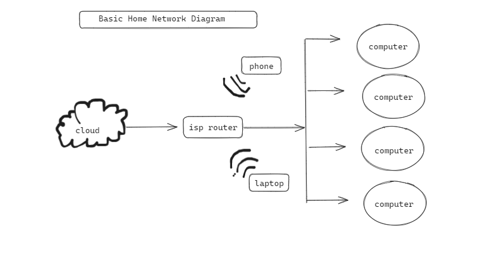
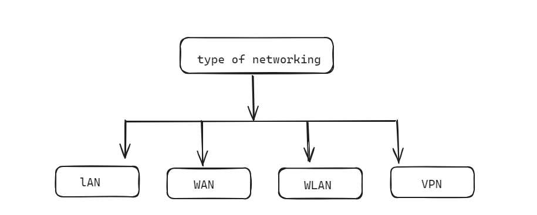

### Topic : Networking
----

Before knowing what networking really was:
Before delving into the world of networking, my understanding was limited to basic concepts of computer usage. I primarily saw computers as standalone devices used for tasks like word processing, internet browsing, and entertainment. The idea of how computers communicated with each other or shared resources was vague and abstract.

As technology became increasingly integrated into daily life, I began to wonder about the underlying mechanisms that facilitated communication between devices. The curiosity to understand how data traveled across networks, how websites were accessed, and how emails were sent piqued my interest in networking.

Despite the initial complexity, I felt excited about the prospect of learning more about networking. The realization that understanding networking fundamentals could unlock new possibilities for communication, collaboration, and innovation fueled my enthusiasm. I anticipated a journey of discovery and growth as I embarked on my networking education.

What i learned and understood about network:
Networking Basics:

Networking involves connecting computers and devices to share resources and information.
Components include routers, switches, hubs, cables, and protocols like TCP/IP.
The primary purpose is to facilitate communication and resource sharing.

Types of Networks: 

Local Area Network (LAN): Covers a small geographic area like an office or building.
Wide Area Network (WAN): Spans large geographic areas, connecting LANs across cities or countries.
Wireless Networks: Use wireless communication technologies like Wi-Fi or Bluetooth.
Internet: The global network of networks enabling worldwide communication and information exchange.
Public Network: Network accessible to the public, such as the Internet, often used for accessing resources outside of a private network.
Private Network: Restricted network accessible only to authorized users, typically within an organization or a specific location.

Networking Devices:

   - Router: Forwards data packets between computer networks at the Network layer.
   - Switch: Connects multiple devices within a LAN and forwards data to the intended recipient.
   - NAT (Network Address Translation): A technique that maps private IP addresses to public IP addresses, enabling multiple devices within a private network to share a single public IP address for communication with external networks.

Networking Protocols:

   - TCP/IP: The foundational protocol suite for the Internet.
   - HTTP/HTTPS: For transferring web pages and resources on the World Wide Web.
   - FTP: Facilitates file transfers between clients and servers.
   - DNS: Translates domain names into IP addresses.

conclusion:
- Understanding networking fundamentals is crucial for navigating the interconnected world of technology.
- Concepts such as IP addressing, routing, and protocols form the backbone of modern communication systems.
- Networking knowledge empowers individuals to troubleshoot connectivity issues, optimize network performance, and implement security measures.
- Continual learning and staying updated with advancements in networking technologies are essential for professional growth and adaptability in the rapidly evolving tech landscape.

Bandit level 0-20
Level 0:
- Received an introduction to the Bandit game and learned to log into the server using SSH with default credentials.

Level 1:
- Successfully logged in via SSH using provided username and password.
- Located the password for the next level in the readme file using 'cat' command.

Level 2:
- Used SSH to log in.
- Discovered the password for the next level in a file named '-' using 'cat' command.

Level 3:
- Logged in with SSH.
- Found the password in a hidden file named .hidden using 'ls' and 'cat' commands.

Level 4:
- Successfully logged in.
- Used 'ls' command to identify files and 'cat' command to read contents.
- Located the password in the file named inhere/-.

Level 5:
- Logged in successfully.
- Identified the password file using 'ls' command.
- Used 'find' command to locate the password file within directories.
- Retrieved the password using 'cat' command.

Level 6:
- Accessed the server via SSH.
- Utilized 'find' command to search for files with specific properties.
- Located the password file within an intricate directory structure.

Level 7:
- Successfully logged in.
- Used 'grep' command to search for specific content within files.
- Discovered the password hidden within the data.txt file.

Level 8:
- Logged in successfully.
- Employed 'sort', 'uniq', and 'grep' commands to process and filter data.
- Extracted the password from the provided data file.

Level 9:
- Accessed the server.
- Used 'strings' command to extract human-readable text from binary files.
- Discovered the password encoded in the data.txt file.

Level 10:
- Logged in via SSH.
- Utilized 'base64' command to decode encoded data.
- Extracted the password from the encoded data in the data.txt file.

Level 11:
- Successfully logged in.
- Used 'tr' command to perform character substitution.
- Deciphered the password from the provided data.

Level 12:
- Logged in via SSH.
- Identified the password file with 'ls' command.
- Utilized 'xxd' command to convert hexdump into binary.
- Unpacked the binary data to obtain the password.

Level 13:
- Accessed the server using SSH.
- Located the password file with 'ls' command.
- Used 'openssl' command to decrypt the password file.

Level 14:
- Successfully logged in.
- Discovered a script that provided the password for the next level.
- Executed the script to retrieve the password.

Level 15:
- Logged in via SSH.
- Located the password file with 'ls' command.
- Utilized 'netcat' to connect to a port and send data to obtain the password.

Level 16:
- Logged in successfully.
- Used 'nmap' to scan for open ports.
- Discovered a service running on a specific port that provided access to the password.

Level 17:
- Accessed the server via SSH.
- Used 'diff' command to compare two files and identify differences.
- Discovered a password encoded within a file's metadata.

Level 18:
- Successfully logged in.
- Utilized SSH private key authentication.
- Retrieved the password from a file using the private key.

Level 19:
- Logged in via SSH.
- Identified a setuid binary with elevated privileges.
- Leveraged the binary to execute commands as another user and obtain the password.

Level 20:
- Accessed the server using SSH.
- Located a setuid binary with elevated privileges.
- Exploited the binary to execute commands as another user and retrieve the password.
