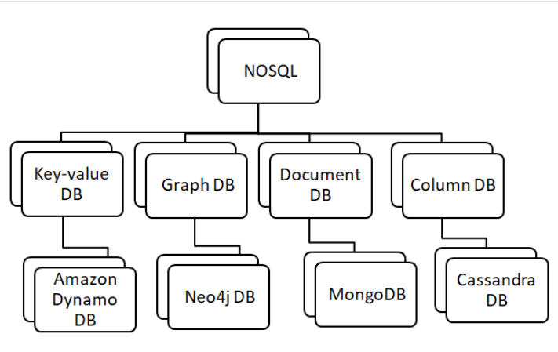
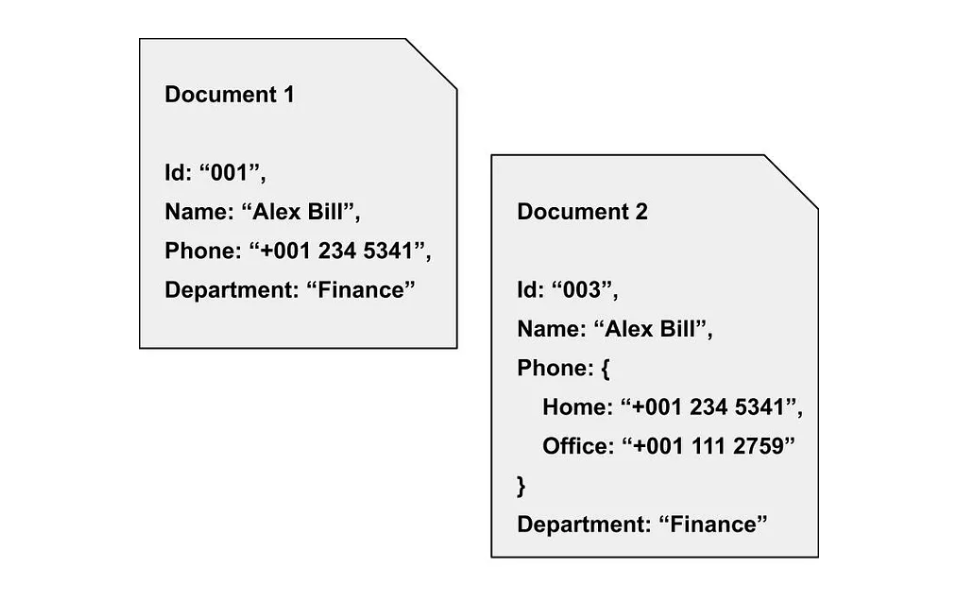
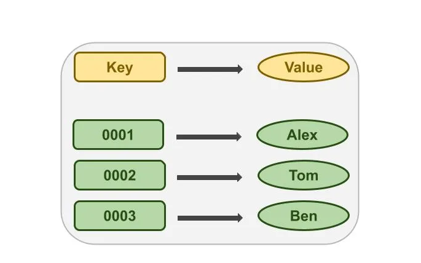
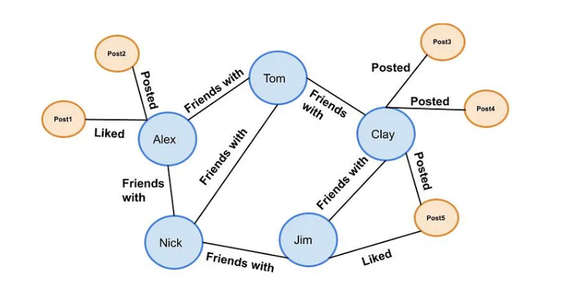
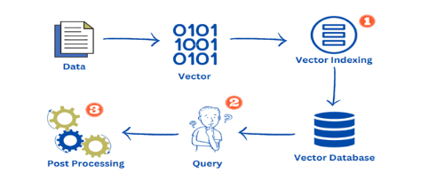
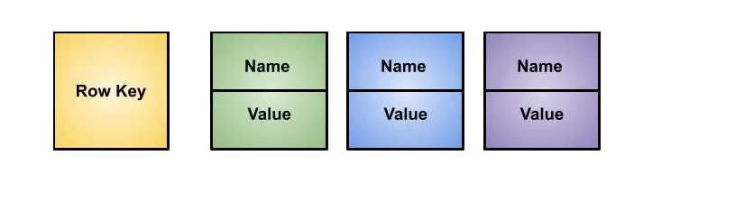

### Topic : Nonrelational Databases
----

This session delve into the various types of nonrelational databases, which include document-based, key-value, graph, vector, time-series, and column-oriented databases. The emphasis is on recognizing the benefits, drawbacks, and applications of each form of nonrelational database.

 
what i learned:
1.Document-based Databases: store data in flexible, semi-structured documents, typically in formats like JSON or BSON. Each document can have its own unique structure, allowing for easy storage of varying data types and complex hierarchical relationships.

Advantages:
Flexible schema allows for easy data modeling and storage of complex structures.
Suitable for handling unstructured or semi-structured data.
Enables efficient querying and retrieval of data.

Disadvantages:
Lack of strong consistency may lead to data inconsistency in distributed environments.
Increased storage overhead due to storing document metadata.

Applications:
Content management systems
Catalogs and product information management
Real-time analytics

2.Key-Value based Databases: store data as a collection of key-value pairs, where each key is unique and maps to a corresponding value.

Advantages:
Simple data model allows for fast read and write operations.
Highly scalable and suitable for distributed environments.
Well-suited for caching and session storage.

Disadvantages:
Limited querying capabilities compared to other database types.
Data retrieval efficiency may decrease with large datasets.

Applications:
Session management
User preferences and settings storage
Distributed systems

3.Graph Databases: designed to represent and store data in terms of nodes, edges, and properties, making them ideal for modeling complex relationships between entities. 

Advantages:
Allows for efficient representation and querying of complex relationships.
Well-suited for analyzing interconnected data structures.
Supports traversing relationships between entities.

Disadvantages:
Higher storage and processing requirements for large-scale graphs.
Complex queries may result in performance bottlenecks.

Applications:
Social networks
Recommendation engines
Fraud detection

4.Vector Databases:specialized databases optimized for storing and querying high-dimensional vector data. 

Advantages:
Optimized for handling high-dimensional datasets.
Efficient storage and retrieval of vector-based data.
Well-suited for machine learning and AI applications.

Disadvantages:
Limited support for non-vector data types.
May require specialized algorithms for certain operations.

Applications:
Image recognition
Natural language processing
Recommendation systems

5.Time-series Databases: databases are optimized for storing and querying time-stamped data, such as sensor readings, financial market data, and server metrics. 

Advantages:
Optimized for storing and analyzing time-stamped data.
Efficient handling of large volumes of time-series data.
Supports advanced time-based querying and aggregation.

Disadvantages:
Limited flexibility for storing non-time-series data.
May require additional indexing and optimization for complex queries.

Applications:
IoT sensor data storage and analysis
Financial data analysis
Monitoring and alerting systems

6.Column-oriented Databases: store data in columns rather than rows, making them well-suited for analytical queries and data warehousing applications.

Advantages:
Optimized for analytical queries and aggregations.
Efficient compression techniques reduce storage requirements.
Well-suited for read-heavy workloads.

Disadvantages:
Slower write performance compared to row-oriented databases.
Limited support for transactional operations.

Applications:
Data warehousing
Business intelligence and analytics
Log data analysis

what i did:
In the initial stage, our class was divided into two distinct groups: the expert group and the home group. Within the expert group, we were further subdivided into six smaller groups, each assigned a specific topic. My group was tasked with exploring the intricacies of time-series databases. We engaged in comprehensive discussions within our expert group, delving into the advantages, disadvantages, and applications of time-series databases, ensuring that we were well-prepared to share our insights with our home group.

After our expert group discussion, we transitioned to our home group, where we presented the information gathered and discussed during the expert group session. We shared the key points regarding time-series databases, including their strengths, weaknesses, and practical applications.

conclusion
In conclusion, flipped session showcased the effectiveness of a structured approach in exploring diverse topics within the realm of nonrelational databases. Overall, the session demonstrated the effectiveness of teamwork and collaboration in providing comprehensive learning experiences.