### Topic : OWASP Top 10 - 2021
----

Introduction:
In today's digital landscape, web applications have become an essential part of our daily lives, enabling everything from online shopping to social networking. However, with their simplicity comes the potential of security flaws, which may risk critical data and lead to unwanted attacks. This provide a beginner-friendly overview of typical web application security vulnerabilities, as defined by the Open Web Application Security Project (OWASP), as well as practical insights into their exploitation.

Broken Access Control
Cryptographic Failures
Injection
Insecure Design
Security Misconfiguration
Vulnerable and Outdated Components
Identification and Authentication Failures
Software and Data Integrity Failures
Security Logging & Monitoring Failures
Server-Side Request Forgery (SSRF)

1.Broken Access Control
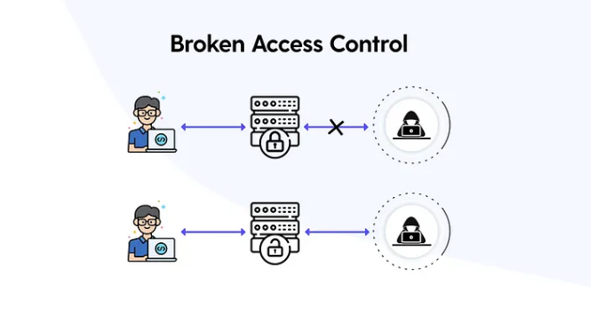
Broken access control refers to a critical vulnerability in web applications where the intended restrictions on accessing certain pages or functionalities are not properly enforced. Essentially, it allows unauthorized users to gain access to protected areas or perform actions they shouldn't be able to. This breach in security can have serious consequences, such as exposing sensitive information or allowing unauthorized manipulation of the application's features.

For instance, consider a scenario where a website's admin panel is meant to be accessible only to privileged users, such as administrators. If a regular visitor can somehow access this admin panel, they might be able to view sensitive data from other users or perform actions reserved for administrators, such as modifying user accounts or deleting content.

An illustrative example of broken access control vulnerability occurred in 2019 with YouTube's private video feature. An attacker discovered that they could access individual frames from private videos, contrary to the expected behavior where private videos should be inaccessible to anyone except the owner. By exploiting this vulnerability, the attacker could reconstruct the video, highlighting the severity of the issue.

In essence, broken access control facilitates unauthorized access to protected resources, undermining the security and integrity of web applications. It underscores the importance of robust access control mechanisms to prevent unauthorized access and safeguard sensitive data and functionalities.

Broken Access Control (IDOR Challenge)
Deploy the machine and go to http://10.10.166.36
Login with the provided username "noot" and password "test1234".
Once logged in, navigate to the section where users' notes are stored.
Try accessing the notes of other users by manipulating the URL parameters, specifically the ID parameter.
Change the ID parameter in the URL to try accessing different users' notes.
Keep testing different ID values until we find the flag, which should be stored in one of the notes.
http://10.10.166.36/note.php?note_id=0 
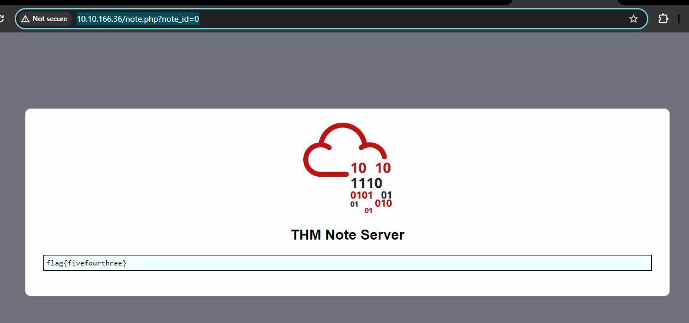
In this case, the flag was obtained using the ID=0, and the challenges were successfully completed

2.Cryptographic Failures
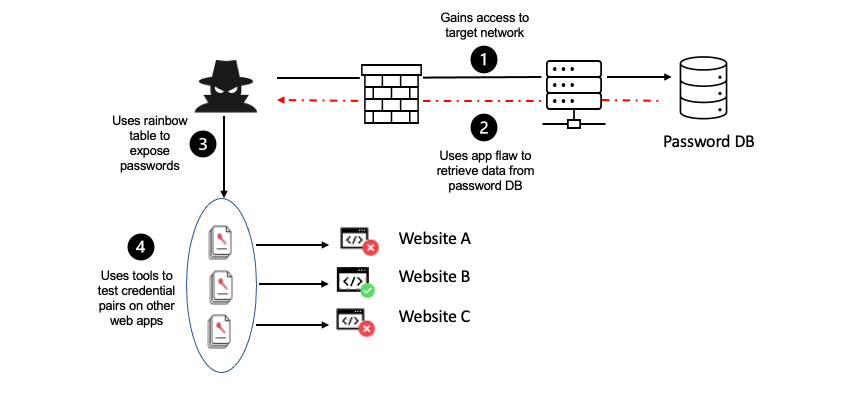
Cryptographic failures in web apps happen when encryption isn't used properly, leaving sensitive info vulnerable. Let's take a secure email app as an example:

Data in Transit: When we check our email in a web browser, we want our messages to be encrypted while traveling between our device and the server. This stops eavesdroppers from snooping on emails.

Data at Rest: Emails are stored on the email provider's server. It's important to encrypt them there too, so even the provider can't read them.

Cryptographic failures can lead to leaks of personal data like names, birthdays, and financial details. Sometimes, attackers can exploit weak encryption to intercept data, even without advanced skills.To prevent these issues, developers need to use strong encryption and regularly check for vulnerabilities in their web apps. This helps keep user data safe from prying eyes.

Cryptographic Failures (Supporting Material 1)
Databases are critical components of web applications because they store enormous amounts of data that may be accessed from multiple locations. While dedicated database servers such as MySQL are prevalent in production situations, smaller applications may use flat-file databases, which are kept directly on the server as single files for convenience.

However, when these flat-file databases are accidentally installed in the root directory of a web application, there is a serious security risk. This oversight allows anyone who visits the website to download and query the database, possibly exposing sensitive information.

SQLite databases, a prevalent format for flat-file databases, can be easily interacted with using tools like sqlite3. Let's walk through a scenario:

Identifying the Database: Upon downloading the database file (e.g., example.db), a simple command like ls -l reveals its presence.
Accessing the Database: Using the sqlite3 command followed by the database name (e.g., sqlite3 example.db), we can access the database for querying.
Viewing Database Structure: The .tables command within the sqlite3 prompt displays the tables present in the database, giving us insight into its structure.
Extracting Data: With the SELECT * FROM table_name; command, we can dump the data stored in a specific table. However, understanding the data's meaning might require examining the table information first.

For instance, suppose it have a table named 'customers' with columns like custID, custName, creditCard, and password. Extracting data from this table reveals sensitive information such as customer names, credit card numbers, and hashed passwords.

Understanding such vulnerabilities highlights the importance of secure database management in web applications. Placing databases outside the web server's public directory and implementing robust encryption for sensitive data are crucial steps in mitigating the risk of data exposure.

Cryptographic Failures (Supporting Material 2)
In the previous, explored how to query an SQLite database to find password hashes of users. Now, let's delve into cracking these hashes to reveal the actual passwords.

For this, we'll utilize Crackstation, an online tool adept at cracking weak password hashes, particularly MD5 hashes. Here's a quick walkthrough:

Accessing Crackstation: Navigate to the Crackstation website, which provides a user-friendly interface for hash cracking.
Inputting the Hash: Paste the password hash (e.g., 5f4dcc3b5aa765d61d8327deb882cf99) into the provided field. Solve the Captcha to proceed.
Cracking the Hash: Click on the "Crack Hashes" button to initiate the cracking process.
Viewing the Result: Upon successful cracking, Crackstation will display the decrypted password associated with the hash. In our example, we found that the password for Joy Paulson was "password".

It's important to note that Crackstation operates using an extensive wordlist. If a password is not present in this list, Crackstation may fail to crack the hash.In the context of challenge, if Crackstation fails to crack a hash, it's likely intentionally designed to resist cracking attempts, perhaps using more sophisticated encryption techniques.
By leveraging tools like Crackstation, we shed light on the vulnerability of weak password hashes, emphasizing the importance of employing strong, unique passwords to bolster security in web applications.

3.Injection
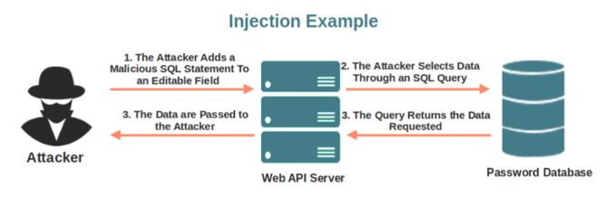
Injection issues, such as SQL and Command Injections, result from misusing user input as commands or parameters, creating significant security threats.

Defense Measures:Allow list validation: Compare input to safe values. Reject anything that isn't on the list.
Input Sanitization: Remove any potentially hazardous characters from the user's input.
Utilize Libraries: There are automated tools available to efficiently deploy these defenses.

By incorporating these safeguards, web applications can protect data and system integrity from injection threats.

Command Injection
The straight concatenation of user-controlled input into the passthru function makes the given PHP code snippet vulnerable to command injection. Here's the reason it's vulnerable:

Input Handling: Using the GET method, the script accepts user input via the "mooing" and "cow" arguments.
Command Execution: The passthru function runs the cowsay command, which allows users to specify their own cow and message. However, the parameters are concatenated straight into the command string, leaving it vulnerable to injection.

An attacker can exploit this issue by changing the "mooing" or "cow" parameters. Using inline command execution in bash ($(your_command_here)), attackers can run arbitrary commands on the server.

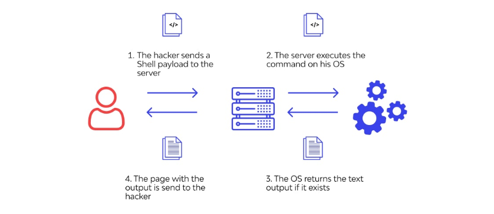
For example, an attacker may use commands like $(whoami) or $(id) to provide user and group information, or $(cat /etc/passwd) to retrieve sensitive system data.

4.Insecure Design
Insecure design vulnerabilities are caused by improper application architecture, which is generally the result of inadequate threat modeling during planning or developer shortcuts. One such example is the Instagram password reset flaw:
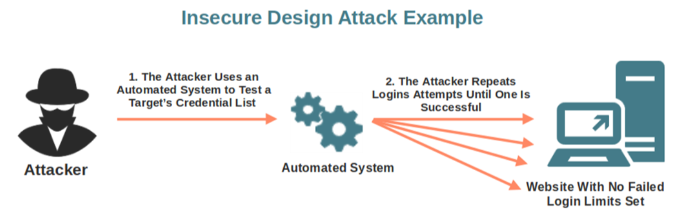

Instagram's password reset procedure required delivering a 6-digit code via SMS for certification. While the platform used rate-limiting (250 tries per IP) to dissuade brute-force assaults, it ignored dispersed attacks.

Using this vulnerability, an attacker might use numerous IP addresses to attempt 250 codes per IP, considerably improving their odds of brute-forcing the 6-digit code.

The vulnerability demonstrates a significant flaw in the application's design: the assumption that no user would have hundreds of IP addresses to perform simultaneous brute-force attacks.

Mitigating insecure design vulnerabilities frequently requires recreating impacted components from scratch, which presents considerable obstacles as compared to code-related issues.

To avoid such concerns, thorough threat modeling should be done early in the development lifecycle. Establishing secure development methods, as specified in the Secure Software Development Lifecycle (SSDLC), can help protect programs against insecure design flaws.

5.Security misconfiguraions
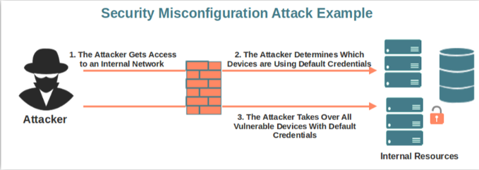
Security misconfigurations, such as exposed debugging interfaces in production software, represent substantial hazards. In cases such as Patreon's claimed 2015 hack, debugging facilities were left turned on, allowing attackers to run arbitrary code through Werkzeug's debug console. Such oversights can result in data leaks and system compromises. To reduce these risks, developers should verify correct configuration, disable debugging functionality in production settings, and perform frequent security audits.

6.Vulnerable and Outdated Components
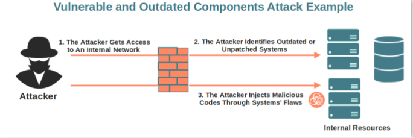
Running out of date software, such as an older version of WordPress, exposes businesses to considerable dangers. Attackers can easily exploit known vulnerabilities, as evidenced by unpatched versions vulnerable to remote code execution attacks. This highlights the vital importance of regular software upgrades in mitigating such vulnerabilities and protecting against potential attacks.

Vulnerable and Outdated Components - Exploit
In this situation, we come across a web server running Nostromo 1.9.6, which is vulnerable to remote code execution (RCE) as per CVE-2019-16278.

Using Exploit-DB, we identify an exploit script designed specifically for this version. However, upon execution, we notice a tiny issue caused by an uncommented line in the script. After resolving the issue, we successfully executed the exploit and obtained RCE on the server.

This example shows the significance of knowing exploit scripts and making any changes as needed. Exploit developers usually provide explicit instructions on the arguments required for successful exploitation, which simplifies the procedure.

While identifying vulnerabilities is not always as simple, comprehensive investigation and understanding of the application's version might lead to effective exploitation. If version information is not readily available, additional inquiry via source code analysis or informed estimates may be required. However, with a known vulnerability, it is usually possible to determine the application's version and exploit it appropriately.

7.Identification and Authentication Failures
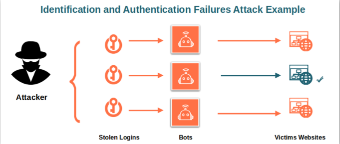
Authentication and session management are critical for web apps because they allow users to access their accounts safely. However, weaknesses in these systems allow attackers to get in:

Brute Force: Attackers try a variety of login combinations to guess passwords.
Weak Passwords: If passwords are overly easy, attackers can simply guess them.
Predictable sessions: Session cookies are easily guessable, allowing attackers to takeover accounts.

To remain safe:
Use Strong Passwords: Make sure users create complex passwords.
To prevent brute force attacks, temporarily freeze accounts after a certain number of failed login attempts.
Try multi-factor authentication (MFA): For further protection, use multiple ways to log in, such as a password and a code given to phone.
These precautions help to keep accounts protected from intruders who try to sneak in.

8.Software and Data Integrity Failures
Integrity means ensuring that data remains untouched and unaltered. Maintaining integrity in cybersecurity is critical to preventing unauthorized or malicious changes to critical data. Hashes or digests are unique numbers generated by applying certain algorithms to data that are commonly used to verify integrity.

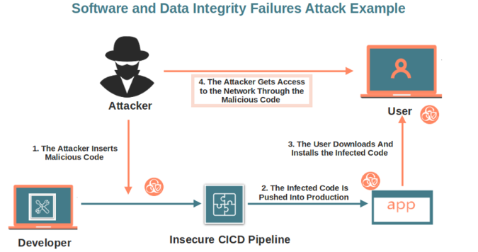
For example, when downloading files such as software installers, hashes are included to ensure their integrity. These hashes can be recalculated after downloading the file to guarantee that it has not been altered during transit.

WinSCP program provides hashes on its Sourceforge repository. After downloading a file, hashes can be recalculated in Linux with programs such as md5sum, sha1sum, or sha256sum. If the recalculated hashes match the ones released, the file's integrity is confirmed.

Integrity problems in software or data occur when systems or applications fail to include integrity checks. This flaw enables attackers to change software or data, resulting in unanticipated results. Integrity problems are classified into two types: software and data integrity failures.

9.Security Logging and Monitoring Failures
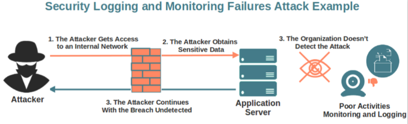
Logging in online applications is critical for tracking user actions and detecting potential security breaches. Without appropriate logging:

Regulatory consequences: A lack of logs can lead to noncompliance with regulations, resulting in fines or penalties, particularly if personally identifiable information is compromised.

Threat of subsequent assaults: Attackers may remain undiscovered, allowing them to conduct additional attacks, steal credentials, or target infrastructure.

Logs provide important information such as HTTP status codes, timestamps, usernames, API endpoints, and IP addresses. Logs must be stored securely and replicated in many locations.

Detecting suspicious activity is critical, such as multiple unauthorized attempts, requests from unusual IP addresses, the usage of automated tools, or common attack payloads. However, simply detecting suspicious activity is insufficient; it must be assessed based on its impact in order to inspire timely replies.

10.Server-Side Request Forgery (SSRF)
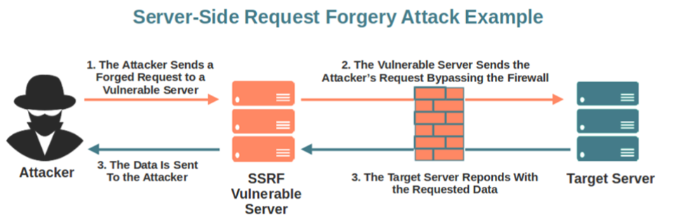
Server-Side Request Forgery (SSRF) is a vulnerability in which an attacker manipulates a web application to send requests to unintended destinations controlled by the attacker. This frequently happens when the program interacts with external services.

Consider a web application that sends SMS notifications via an API. If the app has an option that allows users to define the API server, attackers can exploit it to point to their server. This allows them to intercept requests and potentially obtain sensitive information or undertake unauthorized actions.

SSRF can result in a variety of harmful acts, including:
Internal network enumeration reveals IP addresses and ports.
To gain access to restricted services, exploit server trust connections.
Interacting with non-HTTP services to enable remote code execution (RCE).

It's essential to address SSRF vulnerabilities to prevent unauthorized access and data breaches.

Conclusion
Continuously updating web apps is required to address emerging vulnerabilities and maintain security. Failure to do so may result in a variety of dangers, including data breaches and reputational damage. Understanding and mitigating vulnerabilities identified by resources such as OWASP can dramatically improve web application security. Organizations can limit the likelihood and severity of security breaches by remaining educated and proactive.

