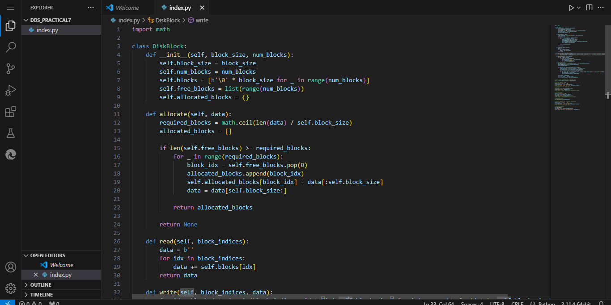
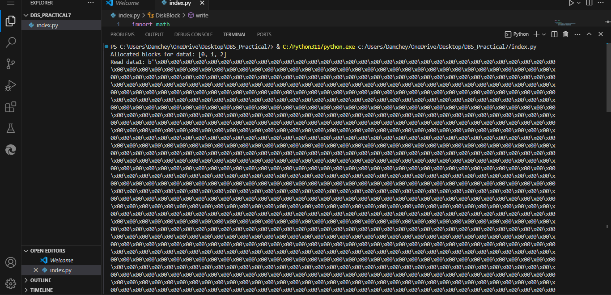
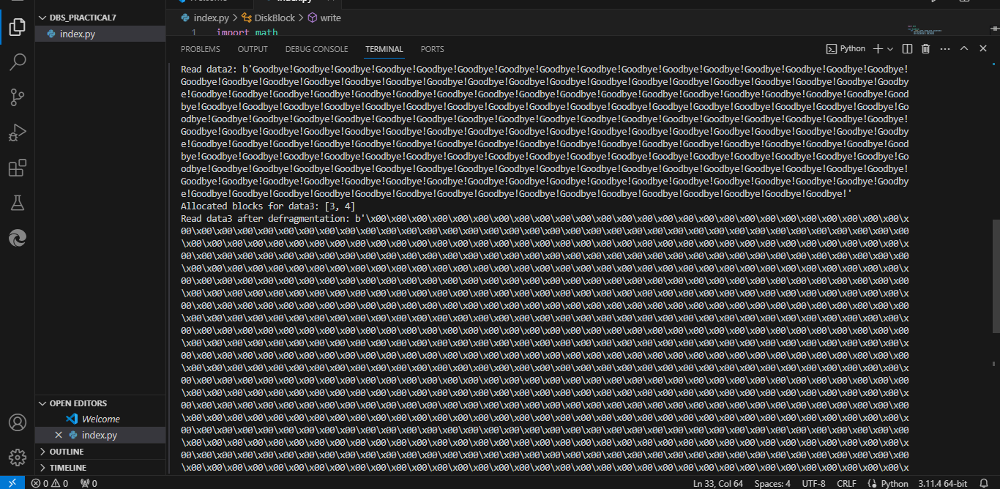
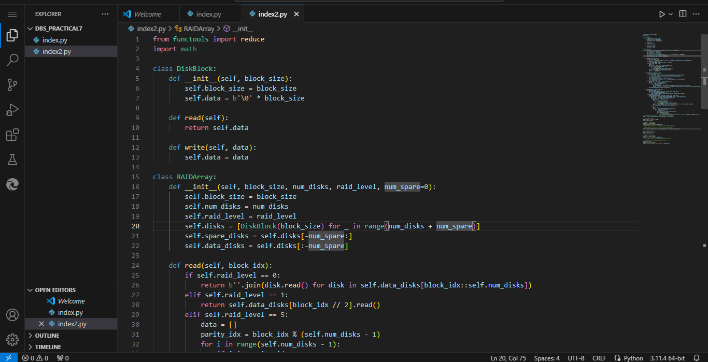
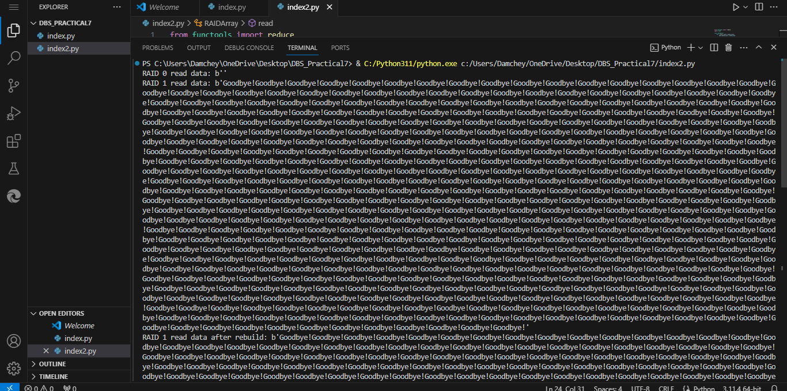
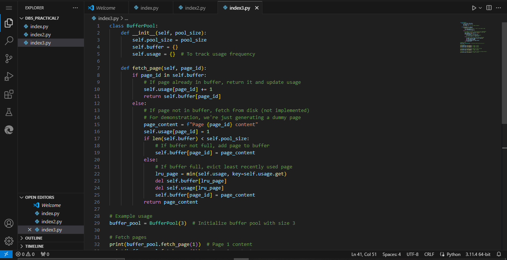
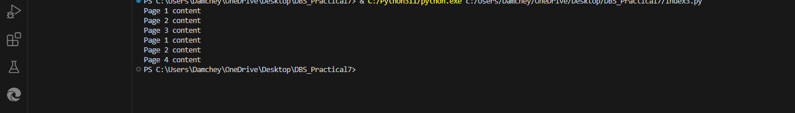
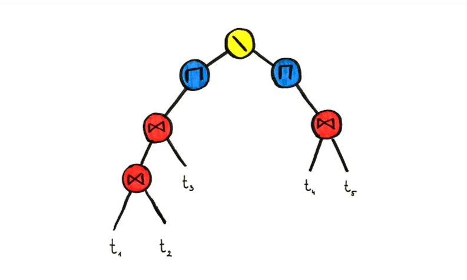
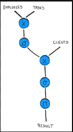

### Topic : Storage and Buffer Management & Building a Relational Database from Scratch
----

Guided session:
For this, I dived into the complex realm of storage and buffer management, simulating disk blocks, RAID settings, and buffer pools using Python implementations.

Task 1: Disk Block Implementation

I began by creating a simulation of a disk block system using the DiskBlock class. This implementation allows you to allocate, read, write, deallocate, and defrag disk blocks. It's intriguing to see how continuous blocks of data are allocated, and how defragmentation consolidates fragmented blocks to improve storage efficiency.

Through actual examples, I saw the lifetime of data within disk blocks, from allocation to deallocation and even defragmentation, ensuring seamless and effective storage management.

Task 2: RAID configurations.

Next, I explored RAID settings, specifically RAID levels 0, 1, and 5, using the RAIDArray class. This implementation simulated data striping, mirroring, and parity calculations based on the selected RAID level. I also investigated the process of reconstructing data on a broken drive using spare disks, which is an important part of maintaining data integrity and dependability in RAID systems.

By designing and managing RAID arrays with various configurations, I learned about how data redundancy, striping, and parity contribute to fault tolerance and performance optimization in storage systems.

Task 3: Buffer Pool Management.

Finally, I investigated buffer pool management in database systems using the BufferPool class. This implementation demonstrated the caching of frequently used database pages in memory, which allows for faster access to data. I discovered how the buffer pool dynamically regulates page access and eviction based on usage frequency, resulting in efficient memory consumption and reduced disk I/O operations.

Overall, storage and buffer management investigation revealed important insights into the fundamental mechanisms that maximize data storage, retrieval, and reliability in current computer systems. I am looking forward to more research and experimentation in this fascinating topic.

Exercise:
Building a relational database from scractch:
 

While reading material for building a relational database from scartch, I learned priceless lessons about database architecture, data structures, and software engineering principles. Understanding the intricate workings of tables, indexes, cursors, and relational algebra that underpin SQL queries was essential. B-trees have emerged as critical for effective data storage and retrieval, especially for huge datasets. Designing and constructing the database machine (DBM) enabled me to investigate low-level instructions and optimize query execution. Creating a SQL compiler demonstrated the importance of query optimization and code creation for performance. Creating an intuitive API enabled seamless interaction with the RDBMS. Each data structure, including B-trees, cursors, and abstract syntax trees, played an important part in streamlining database transactions. The RDBMS's reliability and functionality were verified through rigorous integration and testing. Overall, this hands-on experience not only improved my comprehension of RDBMS foundations, but also sharpened my database management and software development skills, creating a solid platform for future pursuits in the industry.