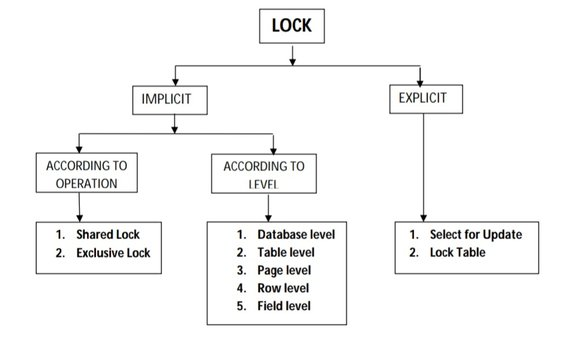

### Topic : Concurrency Control
----
Concurrency Control in DBMS

Concurrency control is a very important concept of DBMS which ensures the simultaneous execution or manipulation of data by several processes or user without resulting in data inconsistency. Concurrency Control deals with interleaved execution of more than one transaction.

Importance of Concurrency Control: 

Concurrency control allows multiple transactions to execute simultaneously without causing data inconsistency. Without it, concurrent transactions could interfere with each other's operations, leading to incorrect or unpredictable results.

Concurrency Control Problems:

Dirty Read Problem: This occurs when one transaction reads data that has been modified by another transaction but not yet committed. It can lead to inconsistencies if the modifying transaction is rolled back.
Lost Update Problem: This arises when two or more transactions update the same data concurrently, causing one update to be lost or overwritten by another transaction.

Concurrency Control Protocols:

Lock-based Concurrency Control: Transactions acquire locks on data items to control access. This prevents conflicts such as dirty reads and lost updates.

Two-Phase Locking Protocol: Ensures a strict ordering of lock acquisition and release to prevent conflicts.

Timestamp-based Concurrency Control: Transactions are assigned timestamps and conflicts are resolved based on these timestamps to ensure serializability.

Advantages of Concurrency:

Reduced Waiting Time: Allows processes to execute concurrently, reducing waiting time.

Improved Response Time: Enables quicker response from the system by parallelizing transactions.

Better Resource Utilization: Allows multiple transactions to utilize system resources simultaneously, improving efficiency.

Increased Efficiency: Enables more work to be done with the given resources, improving overall efficiency.

Disadvantages of Concurrency:

Overhead: Implementing concurrency control mechanisms adds overhead, potentially impacting performance.

Deadlocks: Circular dependencies between transactions can lead to deadlocks, where transactions are unable to proceed.

Reduced Concurrency: Concurrency control mechanisms may limit the number of concurrent transactions, reducing overall system concurrency.

Complexity: Managing concurrency control can be complex, especially in distributed systems, leading to increased development and maintenance costs.

Inconsistency: Improper concurrency control can lead to data inconsistencies and inaccuracies in the database.

Conclusion:

Concurrency control is essential for maintaining data consistency and integrity in DBMS. While it introduces challenges such as overhead and complexity, the benefits of reduced waiting time, improved response time, resource utilization, and efficiency outweigh these challenges. Properly implemented concurrency control mechanisms ensure transaction atomicity, isolation, consistency, and serializability, thereby providing a robust foundation for database systems.

### Topic : Lock and Latches 
----

What Are Locks?

Locks are tools used in databases to control access to data. They help ensure that multiple transactions can work with data without causing conflicts or errors.

Database Lock

A database lock lets transactions read or write data in a way that prevents conflicts and keeps the data accurate.

Lock Types:

Different types of locks are used based on how data needs to be accessed and protected. The main types are shared locks, exclusive locks, and update locks.

Shared Lock:

A shared lock, also known as a "read lock," allows many transactions to read the same data at the same time. However, while a shared lock is active, no transaction can write to that data.

Exclusive Lock:

An exclusive lock allows only one transaction to write to a data item. When an exclusive lock is in place, no other transaction can read or write that data. This ensures that the data isn't changed by anyone else while it's being updated.

Update Lock:

An update lock is a middle ground between shared and exclusive locks. It allows transactions to read data while preventing other transactions from making conflicting updates. This lock helps prevent issues that can arise when multiple transactions try to update the same data simultaneously.

Conclusion

Locks are essential for managing access to data in databases. Shared locks let many transactions read data at the same time, exclusive locks let one transaction write data without interference, and update locks allow reading but control updating to avoid conflicts. These locks help keep data consistent and reliable.

What Are Latches?

A latch is a synchronization mechanism used in databases to control access to shared resources and ensure data consistency. They are particularly useful in database management systems (DBMS) for protecting data structures or buffers from being accessed by multiple transactions or threads at the same time.

Database Latch

Latches are designed for rapid acquisition and release, often within a single CPU cycle. This makes them ideal for protecting frequently accessed data structures in a DBMS.

Latch Types

Latches can operate in two modes: shared and exclusive.

Shared Latch: Allows multiple transactions or threads to read the resource simultaneously.
Exclusive Latch: Allows only one transaction or thread to write to the resource, preventing other modifications.

Latch Acquisition

When a thread or process needs to access a resource protected by a latch, it requests the latch through a function or system call provided by the DBMS.

Spin-Waiting: If the latch is currently held by another transaction or thread, the requester may enter a spin-waiting state, repeatedly checking the latch until it becomes available. This method reduces context-switching overhead but can consume CPU cycles if the wait is long.

Latch Release

After completing its operation on the shared resource, the thread releases the latch using another function or system call provided by the DBMS.

Notification: When the latch is released, the DBMS notifies waiting threads, which then compete to acquire the latch and proceed with their operations.
Since latches are frequently acquired and released, they are designed to be quick and lightweight to minimize performance impact.

Conclusion

Latches are critical for managing concurrent access to shared resources in databases, ensuring data consistency and efficient operation. Shared latches allow multiple reads, while exclusive latches control writes. The quick acquisition and release of latches make them suitable for high-frequency use in a DBMS.

Differences Between Locks and Latches

Locks and latches are synchronization mechanisms in database systems but serve distinct purposes and operate at different levels within the system:

Conclusion

Locks and latches are crucial synchronization mechanisms in databases. Locks manage transactional access to data, ensuring consistency and preventing conflicts by allowing controlled read and write operations. Latches, on the other hand, ensure efficient and consistent access to internal data structures, being designed for rapid, high-frequency use. Understanding their differences and applications helps maintain database performance and integrity.

### Timestamp Ordering Concurrency Control 
----

Timestamp-Based Concurrency Control (TCC) is a method used in databases to manage transactions so they don't interfere with each other and maintain data consistency.

1.Timestamp Assignment: Each transaction is assigned a timestamp based on when it enters the system. New transactions are assigned timestamps greater than those of older transactions.

2.Ordering Transactions: Transactions are executed in such a way that their timestamps determine the serializability order. This means that conflicting read and write operations are executed in timestamp order.

3.Timestamp Values: Two timestamp values are associated with each database item:

W_TS(X): The largest timestamp of any transaction that successfully executed a write operation on item X.

R_TS(X): The largest timestamp of any transaction that successfully executed a read operation on item X.

4.Basic Timestamp Ordering (TO) Algorithm:

When a transaction T issues a write operation W_item(X), it checks if R_TS(X) or W_TS(X) is greater than T's timestamp. If so, T is aborted; otherwise, the write operation is executed, and W_TS(X) is updated.

When a transaction T issues a read operation R_item(X), it checks if W_TS(X) is greater than T's timestamp. If so, T is aborted; otherwise, the read operation is executed, and R_TS(X) is updated.

Advantages:

High Concurrency: Allows for a high degree of concurrency among transactions.

Efficiency: Does not require locking and can handle a large number of transactions efficiently.

Deadlock-Free: Since no locks are involved, there is no possibility of deadlocks occurring.

Improved Performance: By enabling concurrent execution, overall performance is enhanced.

Disadvantages:

Limited Granularity: Granularity is limited to the precision of timestamps, potentially causing unnecessary blocking.

Timestamp Management: Requires careful management of timestamps to ensure correct transaction ordering.

Clock Synchronization: Relies on synchronized clocks; lack of synchronization can lead to incorrect transaction ordering.

Timestamp Allocation: Assigning unique timestamps can be challenging, especially in distributed systems.

Strict Timestamp Ordering: A variation of Basic TO ensures strict and conflict serializability by delaying read or write operations if necessary.

In conclusion, while Timestamp Ordering Protocol offers benefits like high concurrency and efficiency, it also poses challenges such as limited granularity and the need for precise timestamp management. It's a valuable tool for ensuring transaction serializability and concurrency in database systems.

### Two Phase Locking
----

Two-Phase Locking (2PL)

Two-Phase Locking is a method to ensure that database transactions are executed in a serial order, meaning they don't interfere with each other in a way that causes errors.

How It Works

Growing Phase: The transaction can acquire (take) new locks but cannot release (give up) any locks.

Shrinking Phase: The transaction can release (give up) locks but cannot acquire (take) any new locks.

A lock is a mechanism that prevents other transactions from accessing a data item while it's being used.

Example
Imagine two transactions, T1 and T2, accessing and modifying some data items, A, B, and C.

Transaction T1
Lock-S(A) - Takes a shared lock on A.
Lock-X(B) - Takes an exclusive lock on B.
(Lock Point: No more locks acquired after this point)
Unlock(A) - Releases lock on A.
Unlock(B) - Releases lock on B.

Transaction T2
Lock-S(A) - Takes a shared lock on A.
Lock-X(C) - Takes an exclusive lock on C.
(Lock Point: No more locks acquired after this point)
Unlock(A) - Releases lock on A.
Unlock(C) - Releases lock on C.
Issues with 2PL

Cascading Rollbacks: If one transaction fails, other transactions that read data from the failed transaction also have to roll back.

Deadlocks: Two transactions can get stuck waiting for each other to release locks.

Limited Concurrency: Transactions hold onto locks longer, which can slow down other transactions.

Example of Cascading Rollback
T1 writes to data item X.
T2 reads X from T1.
T1 fails and rolls back.
T2 must also roll back because it read the uncommitted data from T1.

Example of Deadlock
T1 locks data item A and wants data item B.
T2 locks data item B and wants data item A.

Neither can proceed because they are each waiting for the other to release a lock.

Variants of 2PL

Strict 2PL: Transactions hold all exclusive locks until they commit or abort, preventing cascading rollbacks.

Rigorous 2PL: All locks are held until the transaction commits or aborts, ensuring no cascading rollbacks.

Conservative 2PL: Transactions acquire all necessary locks before they start, preventing deadlocks.

Conclusion

Basic 2PL ensures transactions are serializable but can cause cascading rollbacks and deadlocks.
Strict and Rigorous 2PL prevent cascading rollbacks by holding locks until the end.
Conservative 2PL prevents deadlocks by acquiring all locks upfront.
By using these protocols, we can manage how transactions interact with each other, ensuring the database remains consistent and error-free, albeit sometimes at the cost of reduced performance or complexity in managing locks.

